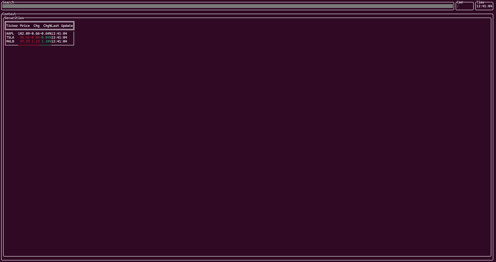

# cliffi

Cliffi is a **C**ommand **L**ine **Interface** **f**or **Fi**nancial securities.

It is currently under development, see **project updates** to see the current progress and objectives.

## Building instructions

### Requirements

OpenSSL is required for this project to build:
```bash
sudo apt-get install libssl-dev
sudo apt-get install libpsl-dev
```

### Build

From project root dir:

```bash
mkdir build
cd build
cmake ..
make -j
```

## Running

To run the program, just run ./diffi from the build folder



## Project updates

### TickerTable

The idea of the TickerTable is to have a default market overview of saved securities. At the moment, I have a broken table rendering (yay), but needs lots of work.

#### ToDo:

[x] Get initial table setup
[x] Dynamically move with prices
[ ] Render into full space
[ ] Fix colouring bug

### Security Overview

The idea of this will be to get an overview of a security, such as historic price

[ ] Get started on initial demo
[ ] Price graph (first line, then candlestick hopefully)
[ ] Security profile

### DerivativesLab

This will be the magnum opus of the project. Viewing mainly the options market with lots of data. Would like to get a probability graph too.

[ ] Finish Security overview, this will inform the direction of this project
